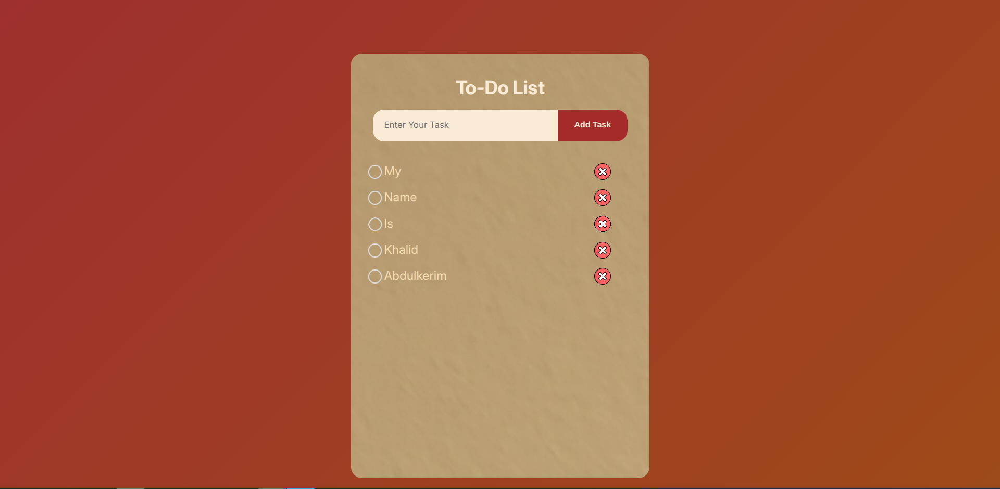
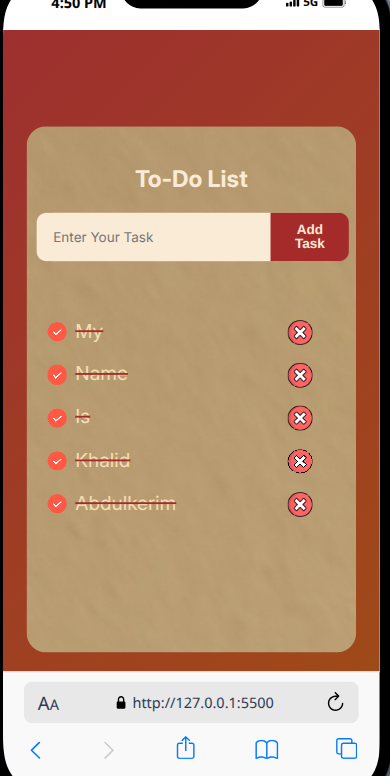

# TO_LIST_PROJECT

A simple and interactive To-Do List web application built using **HTML**, **CSS**, and **JavaScript**.  
It helps users stay organized by adding, deleting, and managing daily tasks in a clean interface.

## Features

- Add new tasks easily
- Delete completed tasks
- Tasks auto-saved in browser (if implemented with `localStorage`)
- Mobile-friendly responsive layout

---

## Screenshot




---

## How to Run Locally

1. **Clone this repository**:
   ```bash
   git clone https://github.com/Kalx6/TO_LIST_PROJECT.git
   ```
